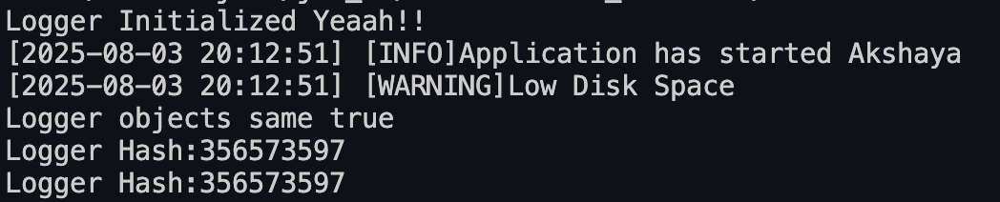
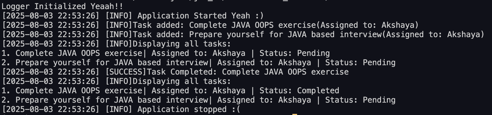

# Smart Logger & Task Manager (Stage 1 - Logger Singleton)

## 💡 Why I Built This?
This is my very first Java project while learning OOP concepts.  
I built this **Logger Singleton** to:
- Practice **Java basics (classes, packages, methods)**
- Learn **Singleton Pattern** (ensure only one object across the app)
- Mimic real-world **logging systems** used in software (time-stamped logs, levels like INFO/WARNING/ERROR)

---

## 🚀 Features
- Implements **Singleton Pattern** (only one Logger instance exists globally)
- Prints **time-stamped log messages** with log levels (INFO, WARNING, ERROR)
- Verifies Singleton with **memory hashcodes**
- Beginner-friendly & well-commented for learning purposes

---

## 📸 Sample Output

---

## 🔥 Stage 2: Encapsulated Task Manager
Built a Task Manager to:
- Learn **Encapsulation** (private fields + getters/setters)
- Manage tasks using **ArrayList**
- Log every action using **Logger Singleton**

### Key Files:
- `Task.java` → Encapsulated task model
- `TaskManager.java` → Adds, completes, and displays tasks with logs

## 📸 Sample Output
